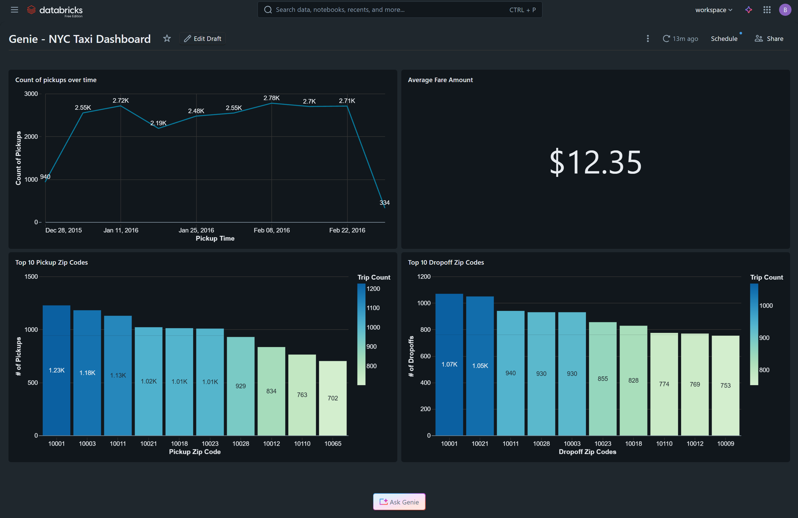

# NYC Taxi AI/BI Genie Dashboard

This project demonstrates the implementation of a modern Business Intelligence solution using **Databricks SQL** and **AI/BI Genie**. It leverages the New York City Taxi dataset to provide both high-level visual insights and a conversational natural-language interface for deeper data exploration.

## 🚀 Project Overview
Inspired by the "Learn Databricks in Under 2 Hours" series by **Alex the Analyst**, this project showcases how to move beyond traditional static dashboards. By integrating Databricks Genie, users can ask complex follow-up questions in plain English, which the AI translates into optimized SQL queries against the underlying Delta Lake tables.

## 🛠️ Tech Stack
* **Platform:** Databricks (Community/Trial Edition)
* **Data Warehouse:** Databricks SQL (Serverless)
* **Language:** SQL, Python
* **BI Tooling:** Databricks AI/BI Dashboards & Genie Spaces
* **Storage:** Delta Lake (Unity Catalog)

## 📊 Key Features
* **Automated Insights:** Real-time visualizations of trip volumes, fare distributions, and peak pickup hours.
* **Conversational Analytics (Genie):** A dedicated Genie space that allows non-technical stakeholders to ask questions like *"What was the average tip percentage for trips over 10 miles?"* * **Data Intelligence:** Leveraging the Unity Catalog to provide governed, secure access to the `samples.nyctaxi.trips` dataset.

### 🤖 Example Genie Queries
To demonstrate the power of the AI/BI Genie space, I configured the following natural-language prompts to test the model's ability to translate business questions into SQL:

* **Financial Insights:** *"Show me the total fare amount by vendor for the last 30 days."*
* **Operational Trends:** *"Which pickup locations have the highest average trip distance during rush hour?"*
* **Customer Behavior:** *"What is the average tip percentage for trips that originated at JFK airport?"*
* **Efficiency Metrics:** *"Compare the total number of trips versus average fare amount per day."*

## 🗺️ Dashboard Preview

## 📖 How it Works
1.  **Data Ingestion:** The project utilizes the NYC Taxi Trip dataset sourced from the Databricks `samples` catalog.
2.  **Transformation:** SQL queries are used to aggregate metrics such as fare amounts, trip distances, and pickup time distributions.
3.  **Visualization:** Standard widgets (Bar, Line, and Map charts) provide the baseline for executive reporting.
4.  **Genie Integration:** A Genie Space is mapped to the dashboard's datasets, using custom "Instructions" to help the AI understand business-specific terminology.

## 🙏 Acknowledgments
* [Alex the Analyst](https://www.youtube.com/@AlexTheAnalyst) for the excellent tutorial on Databricks fundamentals and AI integration.
* The NYC Taxi & Limousine Commission for the open-source data.
