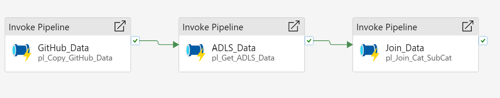
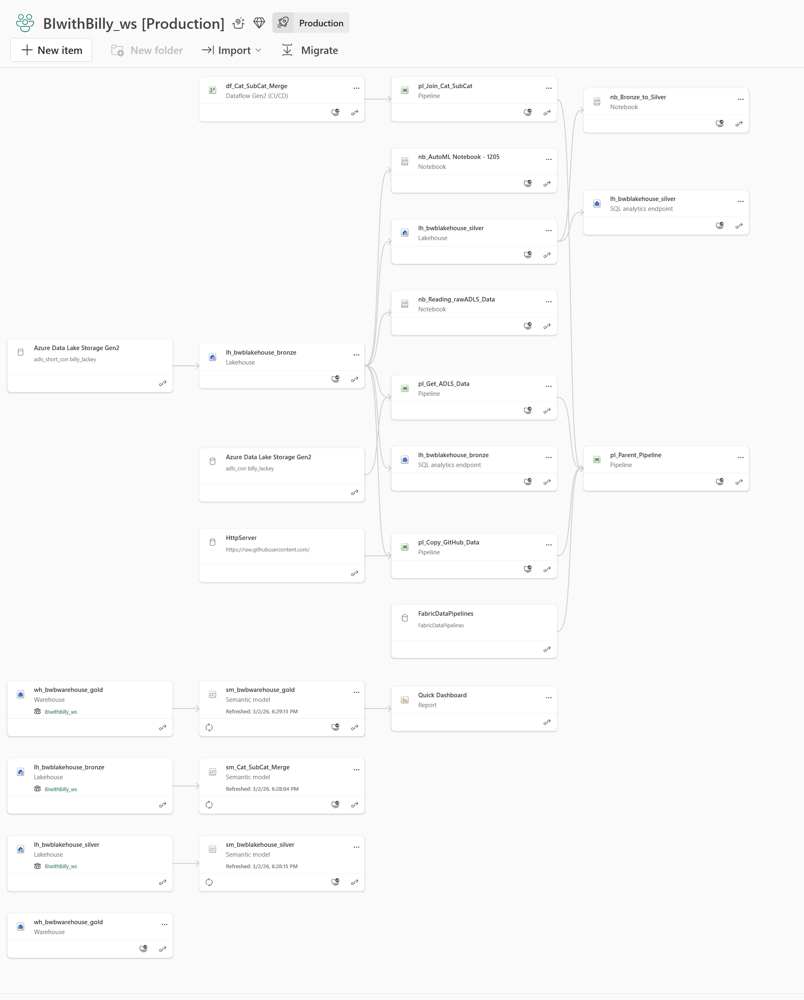
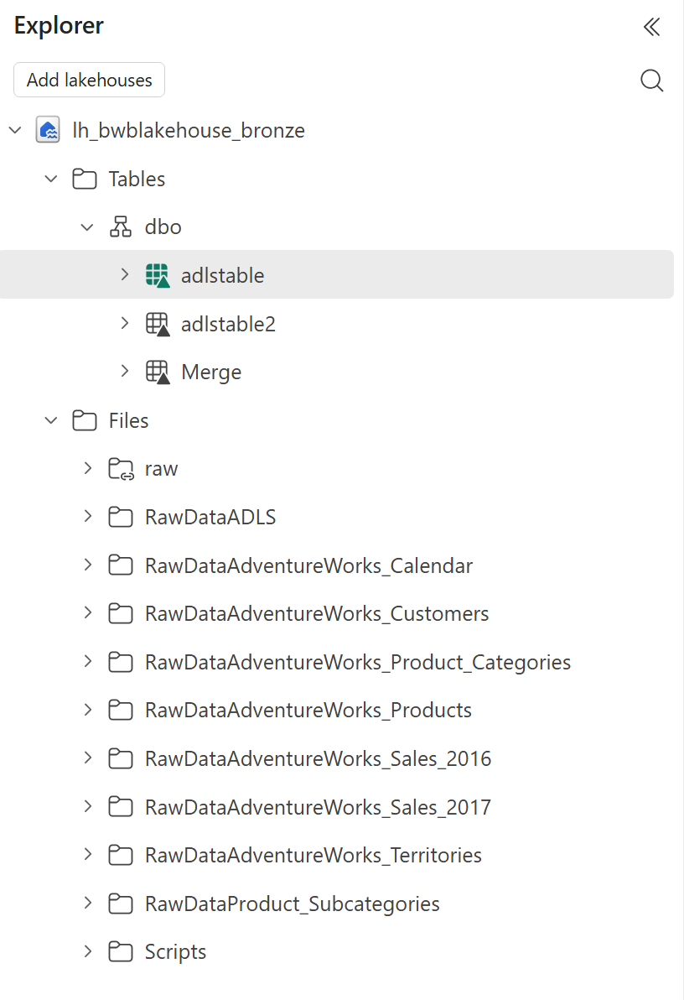
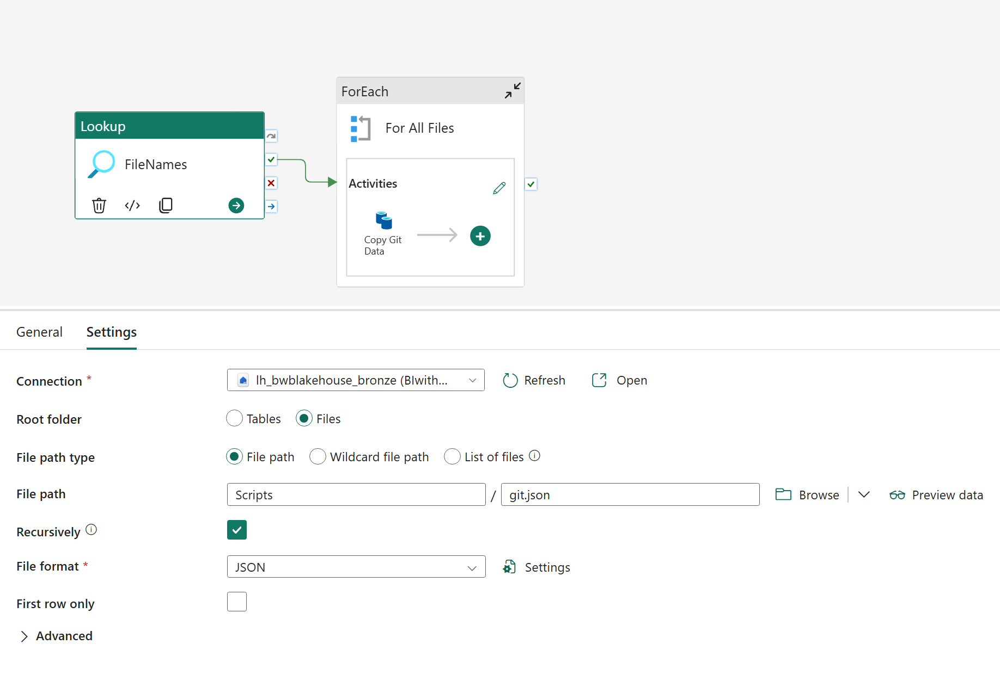
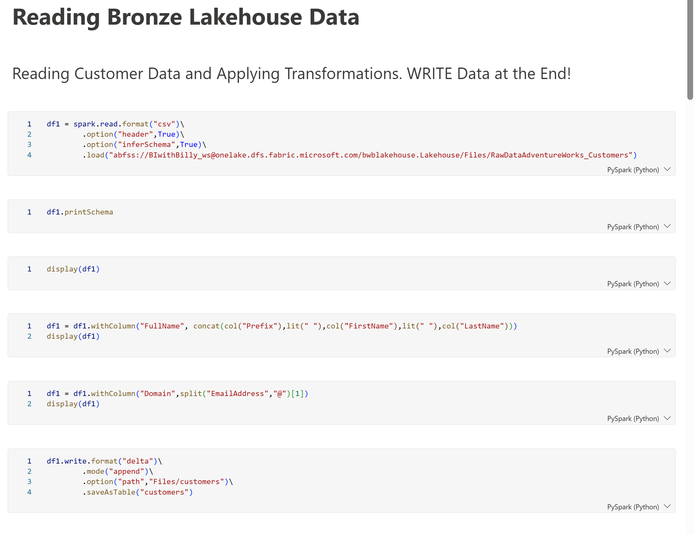
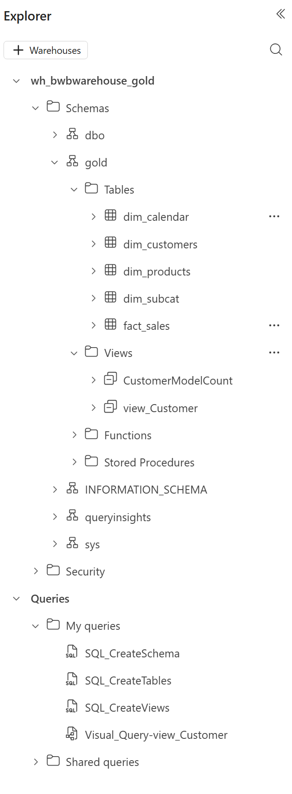
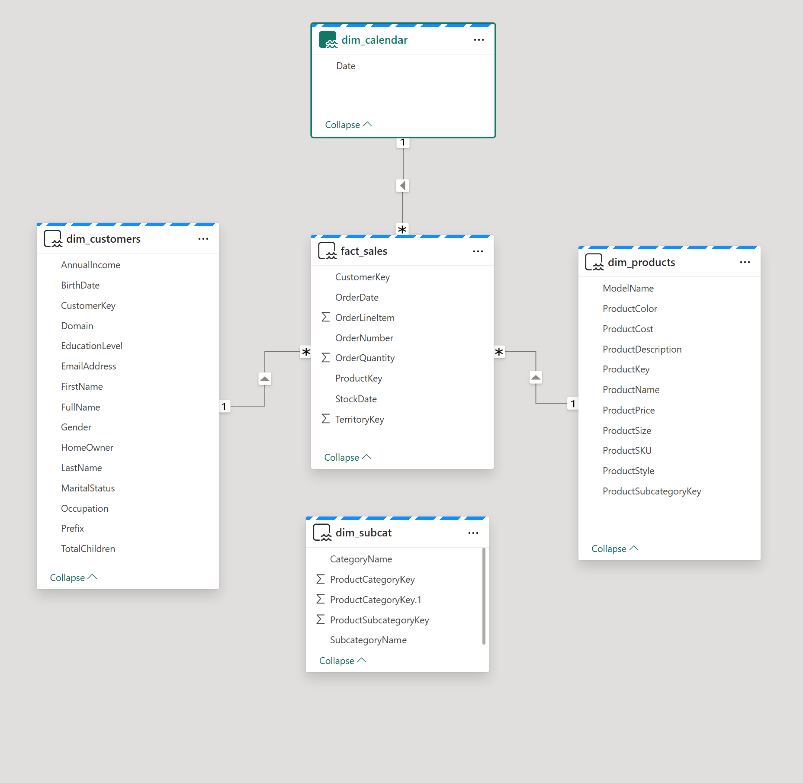
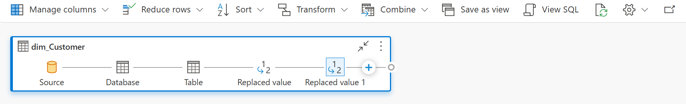
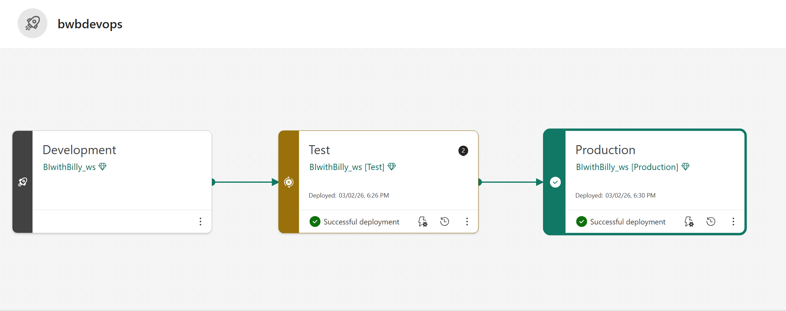
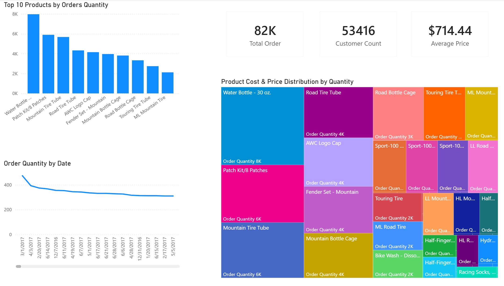

# 🏗️ Microsoft Fabric: End-to-End Medallion Architecture

## 📌 Project Overview
This project demonstrates the implementation of a full-scale **Medallion Architecture** (Bronze, Silver, and Gold layers) within **Microsoft Fabric**. The goal was to build a scalable, automated data pipeline that ingests raw data from disparate sources—**GitHub APIs** and **Azure Data Lake Storage (ADLS) Gen2**—and transforms it into a production-ready dimensional model for advanced analytics.

## 🔗 Orchestration & Data Lineage
The entire solution is orchestrated through a **Parent Pipeline**, ensuring data integrity and proper sequencing from ingestion to final modeling.

| **Parent Pipeline Orchestration** | **End-to-End Lineage** |
| :--- | :--- |
|  |  |
| *Master flow linking ingestion and transformation.* | *Full OneLake lineage from source to Warehouse.* |

## 🏗️ Data Architecture (The Medallion Layers)

### 1. Bronze Layer (Ingestion)
Raw data is ingested into the **Bronze Lakehouse**. This layer acts as a landing zone for unstructured CSV files and initial Delta table conversions.

*Figure: Landing zone for raw ADLS and GitHub data.*

**GitHub Ingestion Detail:**
To handle multi-file ingestion efficiently, I implemented a **ForEach loop** in the ingestion pipeline. This process utilizes a `.json` configuration file to dynamically map source URLs to destination folders, ensuring the architecture is easily scalable for additional datasets.

*Figure: Parameterized ingestion logic using ForEach and JSON metadata.*

### 2. Silver Layer (Standardization)
Using **PySpark Notebooks**, raw data is cleansed and standardized. Transformations include null handling, date standardization, and merging category hierarchies.
* **Code Implementation:** 

### 3. Gold Layer (Dimensional Modeling)
The final stage uses **CTAS** to move data into the **Gold Data Warehouse**. This layer hosts the final Star Schema, featuring optimized tables for executive reporting.

| **Warehouse Explorer** | **Star Schema Model View** |
| :--- | :--- |
|  |  |
| *Structured 'Gold' schema and tables.* | *Final relationship diagram for Fact Sales.* |

## 🛠️ Advanced Analytics & Visual Querying
To showcase Fabric's versatility for different user roles, I implemented **Visual Queries**. This allows for complex data analysis and view creation using a low-code "Power Query" style interface directly on top of the Data Warehouse.

*Figure: Creating a 'Customer View' using the Visual Query editor to perform joins and aggregations without writing SQL.*

## 🚀 CI/CD & Governance
To simulate a professional enterprise environment, I implemented **Fabric Deployment Pipelines**. This allowed for a structured lifecycle management process, moving objects seamlessly from Development to Test and finally into Production across three distinct environments.

*Figure: Lifecycle management showing synchronized Dev, Test, and Prod stages.*

## 📊 Business Intelligence
While the analytical focus of this project was on the data engineering lifecycle, the project culminates in a functional dashboard connected via **Direct Lake** technology. This ensures the architecture is truly **end-to-end**, providing high-speed performance by reading directly from OneLake Parquet files.

*Note: Dashboard utilized to validate the full data flow from raw ingestion to final insight.*

## 📂 Repository Contents
* `Parent_Pipeline.png` - Master orchestration flow.
* `Model_View.png` - Star Schema diagram.
* `Bronze_Lakehouse_Explorer.png` / `Gold_Warehouse_Explorer.png` - Architecture visuals.
* `Copy_GitHub_Data.png` - Dynamic ingestion logic.
* `Visual_Query.png` - Low-code transformation proof.
* `Deployment_Pipeline.png` - CI/CD implementation.
* `BI_with_Billy_Linage.png` - End-to-end data lineage.
