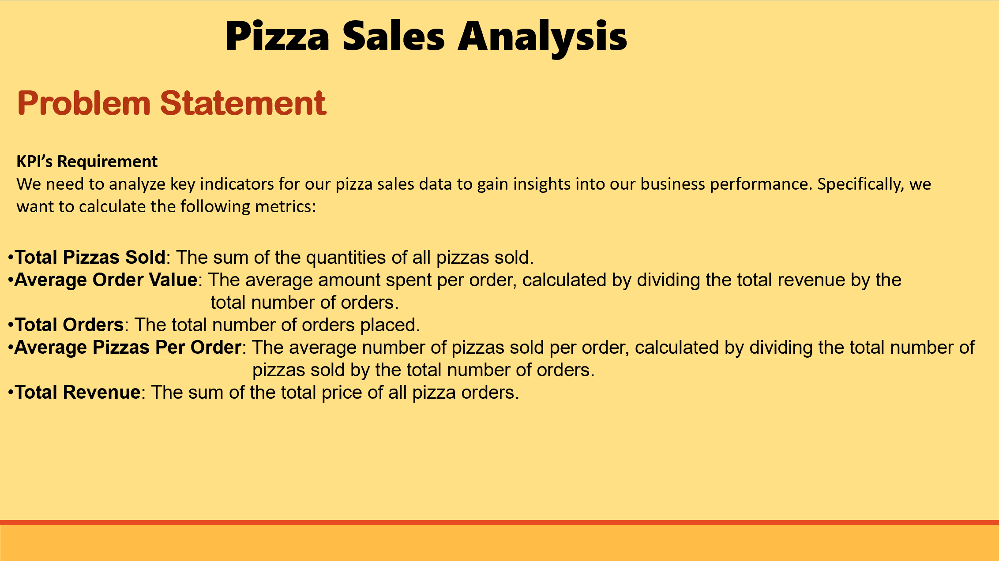
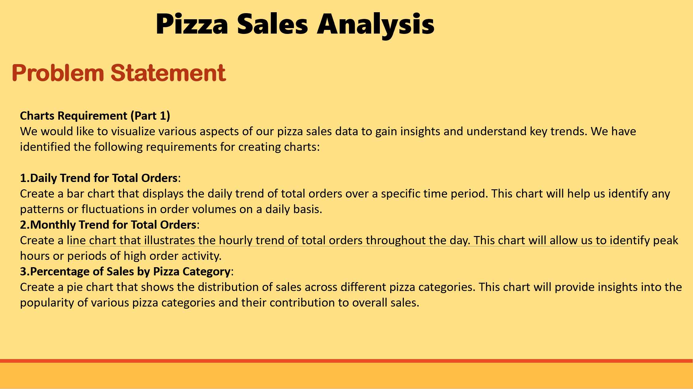
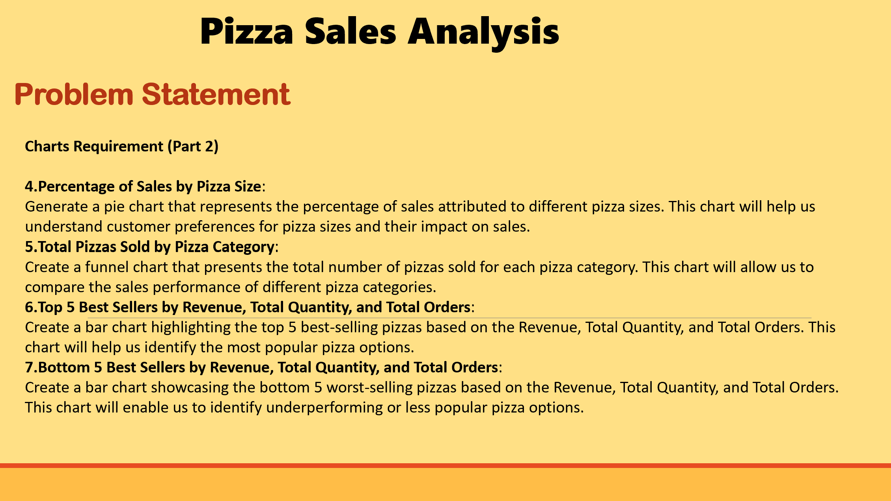

# 📋 Business Requirements: Pizza Sales Analytics

This folder contains the strategic planning and requirement documentation for the Pizza Sales Analytics project. Establishing these clear parameters was the first step in the "Full Stack" lifecycle to ensure the final dashboard delivered measurable business value.

---

## 1. Problem Statement
The first phase focused on identifying the challenges faced by the business, such as lack of visibility into peak ordering times and product performance.

## 2. Project Goals & Scope
This document outlines the specific objectives of the Fabric implementation, defining what was in-scope (Daily/Monthly trends, Category analysis) and what success looked like for the stakeholders.

## 3. Metric & KPI Definitions
To ensure accuracy in the "Gold" layer of the Lakehouse, I defined the exact logic for key metrics like **Average Order Value (AOV)** and **Total Pizzas Sold** before beginning the Data Engineering phase.

---

## 📂 Folder Contents
* [Business Requirement Document.pptx](Business%20Requirement%20Document.pptx) - The original source presentation.
* **BRP1.png, BRP2.png, BRP3.png** - High-resolution captures of the core requirements for quick reference.

[⬅️ Back to Project Root](../README.md)
