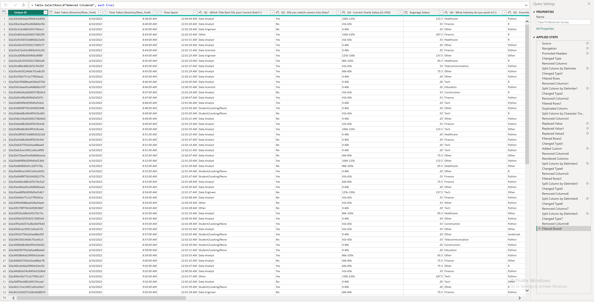

# Data Professional Survey Breakdown

This project transforms raw survey data from thousands of data professionals into an interactive executive dashboard. It highlights salary trends, job satisfaction, and the most popular programming languages across the industry.

## 🚀 The Dashboard in Action

> [!IMPORTANT]
> **[Click here to watch the Interaction Demo](https://github.com/user-attachments/assets/f89f414e-abea-4b55-9b60-0a127d9b7831)** > *(Note: GitHub may require you to download or view the raw file to play the video depending on your browser settings.)*

---

## 🛠️ Data Transformation (The "Dirty" Work)
Before visualization, the raw survey data required significant cleaning in **Power Query**. This process ensured that messy, user-entered survey fields were standardized for accurate reporting.

**Key Cleaning Steps:**
* **Column Standardization:** Cleaned and categorized inconsistent job titles (e.g., merging "Data Scientist" and "Junior DS").
* **Salary Parsing:** Converted text-based salary ranges into numerical averages for calculation.
* **Filtering:** Removed null responses and "troll" entries to ensure data integrity.

### Power Query Transformation Steps:

---

## 📊 Technical Architecture
* **Single-Table Design:** For this survey analysis, a "Flat Table" architecture was utilized to maximize performance for rapid filtering and ad-hoc slicing across 20+ survey dimensions.
* **Custom Tooltips:** Implemented hover-over report pages to provide deep-dive details on salary by country without cluttering the primary visuals.
* **Conditional Formatting:** Used visual cues to highlight outliers in the "Years of Experience" vs. "Salary" correlation.

## 🧮 Sample DAX Measures
To ensure accurate reporting, I developed several measures to handle the survey's numerical ranges:
* **Average Salary:** `Avg Salary = AVERAGE('SurveyData'[Salary_Parsed])`
* **Response Count:** Used to track total participants across different programming language filters.

## 📈 Insights Found
1. **Python vs R:** Python remains the dominant language, but specialized roles showing high R usage correlate with specific academic backgrounds.
2. **Work-Life Balance:** Correlation found between remote work flexibility and overall job satisfaction scores.
