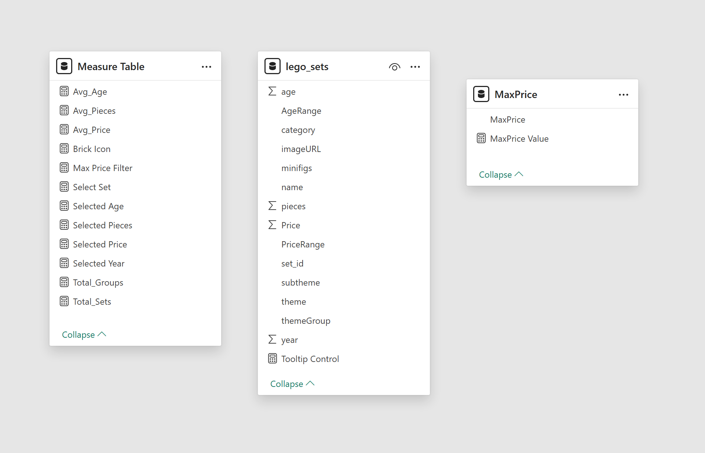

# 🧱 LEGO Set Finder Dashboard

## 📌 Project Overview
This project is an interactive Power BI tool designed for LEGO enthusiasts and collectors to explore over 4,000 sets. Inspired by the nostalgia of purchasing sets for my children—and the legendary Death Star with its massive minifigure count—this dashboard transitions from a simple list into a powerful search engine. It allows users to filter by theme, piece count, age range, and price to find the perfect next build.

## 🖼️ Dashboard Preview
Below is the primary interface for the LEGO Set Finder. You can view the full interactive experience in the [Lego Dashboard.pbix](Lego%20Dashboard.pbix).

## 📊 Key Insights & Features
- **Comprehensive Database:** Explores 4,000+ sets across decades of LEGO history.
- **Deep-Dive Discovery:** Users can analyze sets based on the number of minifigures (perfect for finding sets like the Death Star), retail price, and piece count.
- **Visual Regression:** Includes a regression analysis to identify the relationship between set size and price, helping collectors spot "high-value" sets.
- **Nostalgia Factor:** Easy navigation through classic and modern themes to rediscover sets from years past.

## 🛠️ Technical Implementation

### Data Modeling & Structure
This project utilizes a streamlined flat-table architecture, optimized for performance within Power BI. To maintain a clean and professional development environment, all DAX logic is organized within a dedicated **Measures Table**.

- **Fact Table:** `lego_sets` (Contains all set details, pricing, and piece counts)
- **Calculated Logic:** Managed via a centralized measures folder for scalability.

### Power Query Transformations
I utilized Power Query to clean and structure the LEGO database for analysis:
- **Price Per Piece:** Created a calculated column to determine the value-for-money of different sets.
- **Minifig Density:** Developed logic to highlight sets with high minifigure counts.
- **Data Enrichment:** Cleaned and formatted image URL paths to enable dynamic thumbnail rendering directly within the dashboard visuals.

### Advanced Power BI Techniques
Inspired by the **Maven Analytics** "LEGO Set Explorer" framework, I incorporated several advanced features to enhance the user experience:
- **Numeric Range Parameters:** Allows users to dynamically filter the entire dashboard by specific piece count or price ranges.
- **Custom Image Tooltips:** Hovering over any set name triggers a visual preview of the box art using report page tooltips.
- **Decomposition Trees:** Used to break down set distributions by theme and sub-theme to see where the most "minifig-heavy" sets live.
- **DAX Measures:** - `HASONEVALUE` logic to control visual interactions and prevent blank states.
    - Aggregation measures for **Average Price**, **Total Sets**, and **Total Minifigures**.

## 📈 Price vs. Piece Count Analysis
The regression chart below highlights pricing trends across different set sizes, helping collectors identify which themes offer the most value.

## 📂 Repository Contents
- [Lego Dashboard.pbix](Lego%20Dashboard.pbix) - The primary Power BI development file.
- [lego_sets.csv](lego_sets.csv) - The source dataset containing over 4,000 LEGO sets.
- [LegoDataModel.png](LegoDataModel.png) - View of the single-table model and measures organization.
- [Lego Regression Chart.png](Lego%20Regression%20Chart.png) - Analysis of price vs. piece count.
- [Lego Dashboard Screen Shot 1.png](Lego%20Dashboard%20Screen%20Shot%201.png) - Visual preview of the main report page.

*This project was completed to demonstrate advanced visualization techniques, bookmark actions, and the use of parameters in Power BI.*
