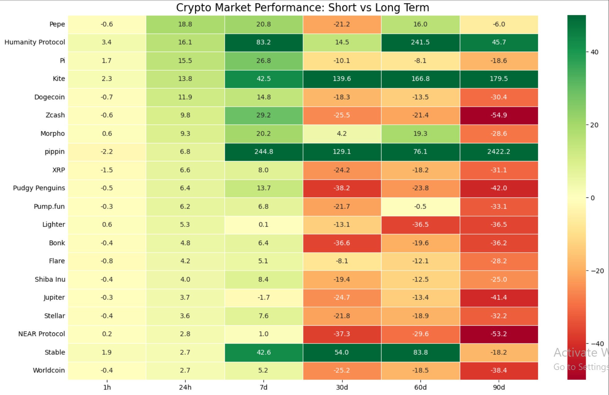
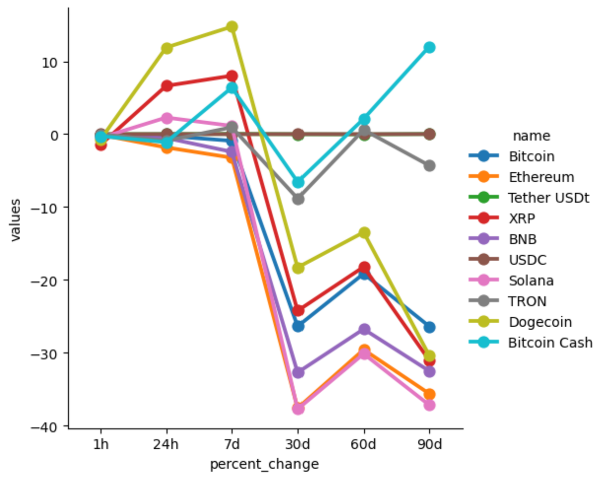

# 📈 Crypto Market Intelligence Dashboard
### *Automated Data Pipeline & Visual Analytics*

This project is a Python-based data engineering and analytics pipeline that interacts with the **CoinMarketCap API** to provide real-time insights into the cryptocurrency market. It transforms raw JSON data into actionable intelligence through localized data persistence and advanced visualization.

## 🚀 Project Overview
The goal was to move beyond simple price tracking and build a system that identifies market momentum and high-volatility "movers" across multiple timeframes.

### Key Features:
* **Automated Data Ingestion:** Connects to CMC API to fetch live metrics for the Top 100 cryptocurrencies.
* **Data Persistence:** Appends data to a local `API.csv` to track historical snapshots.
* **Trend Visualization:** Utilizes **Seaborn** and **Matplotlib** to map market sentiment from 1-hour to 90-day intervals.
* **Volatility Detection:** Automated filtering logic to isolate assets with >10% price swings in a 24-hour window.

## 📊 Visual Insights

### 1. Market Sentiment Heatmap
This heatmap provides a high-density view of performance. By capping the color scale, we can identify steady trends across the market while clearly spotting extreme outliers.

### 2. Top 10 Performance Trends
A longitudinal view of the "Big 10" assets, highlighting how Bitcoin and major altcoins correlate during market shifts.

## 🛠️ Tech Stack
* **Language:** Python
* **Libraries:** Pandas, Seaborn, Matplotlib, Requests
* **API:** CoinMarketCap Professional API

## ⚙️ Setup & Usage
1.  Clone the repository.
2.  Install dependencies: `pip install pandas seaborn requests matplotlib`
3.  Obtain an API Key from [CoinMarketCap](https://pro.coinmarketcap.com/).
4.  Open `Crypto_Dashboard_Public.ipynb` and paste your key into the designated placeholder in the first cell.
5.  Run all cells to generate your own local dataset and visuals.

---
**Note:** The API key has been removed from this public version for security purposes.
